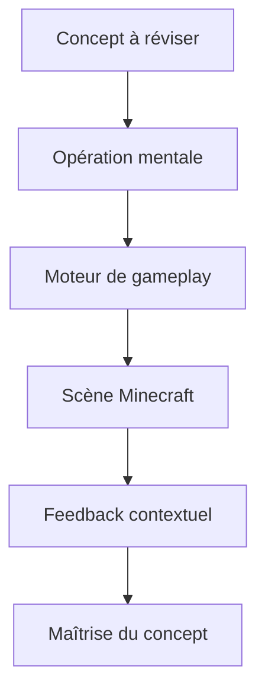

# SWAN — ARCHITECTURE DES QUESTIONS ET DES GAMEPLAYS

## Verdict

Le problème n'est pas que le QCM manque de couleurs. Le problème est que toute la banque est encore décrite avec ce contrat :

```text
une phrase + quatre textes + l'index de la bonne réponse
```

Avec ce format, n'importe quel générateur finit par fabriquer quatre boutons. Il peut les peindre en vert, les transformer en blocs ou les faire exploser : cela reste un QCM.

La bonne base du ZIP est la note `DIRECTION_JEU_QUIZ_MINECRAFT_2026.md`, notamment son idée centrale : « Je ne coche pas une réponse. Je montre que je sais jouer. » Mais il faut aller un cran plus loin. Ses quinze familles mélangent encore trois choses différentes :

- ce que Swan doit savoir ;
- l'opération mentale qui prouve qu'il le sait ;
- le geste et le décor utilisés pour rendre cette preuve amusante.

Il faut séparer ces trois couches. Sinon Claude choisira une animation avant d'avoir compris ce que l'épreuve doit réellement vérifier.

---

## 1. La nouvelle grammaire

Chaque épreuve est construite dans cet ordre :



Exemple :

```text
Concept       : un lingot d'or exige 9 pépites
Opération     : quantifier et construire
Moteur        : grille à remplir
Scène         : établi 3 × 3
Réponse       : Swan place lui-même 9 pépites
Feedback      : le lingot se forge et rejoint le minecart
```

Ce n'est plus « 4, 6, 8 ou 9 ? ». Il fabrique la réponse.

---

## 2. Les dix vraies typologies de questions

Les catégories ci-dessous décrivent la preuve de connaissance, pas le style graphique.

| Type cognitif | Ce que Swan doit faire | Moteurs de gameplay adaptés | Exemple issu de la banque |
|---|---|---|---|
| **1. Identifier** | Reconnaître un élément à ses signes | Fouille de scène, faisceau de torche, cible, silhouette, écoute comparative | Trouver le Creeper qui commence à gonfler parmi plusieurs mobs |
| **2. Associer** | Relier deux éléments qui vont ensemble | Équipement par glisser, câbles, paires, objet vers cible | Donner l'os au loup ; relier l'Évocateur aux Vex |
| **3. Classer** | Construire des ensembles justes | Coffres, tapis roulant, inventaire, portails de tri | Ranger consoles/mobile/Windows dans Bedrock et Forge/Fabric dans Java |
| **4. Quantifier** | Produire une valeur exacte | Empilement, compteur, jauge crantée, cases à remplir | Créer 9 pépites, régler 500 PV, compter 27 slots |
| **5. Localiser** | Placer une cible dans un espace | Coupe verticale, coordonnées Y, carte, biome, exploration | Descendre à Y -59 pour le diamant ; placer la cité ancienne dans le Deep Dark |
| **6. Construire** | Former une recette, une structure ou une topologie | Grille de craft, blocs aimantés, assemblage, inventaire limité | Fabriquer un lit, une boussole ou le portail minimal à 10 obsidiennes |
| **7. Ordonner** | Reconstituer une chaîne d'étapes | Ligne de production, cartes à ordonner, chronologie, transformations successives | Débris antiques → ferraille → lingot de netherite ; naissance du Happy Ghast |
| **8. Prédire** | Annoncer l'effet d'une cause avant de la déclencher | Simulation verrouillée, choix d'intervention, mise en scène puis bouton TESTER | Prévoir la transformation du villageois par la foudre ou le comportement du cuivre |
| **9. Diagnostiquer** | Repérer pourquoi un système échoue et le réparer | Circuit défectueux, recette presque juste, différence Java/Bedrock, pièce intruse | Réparer une redstone ; comprendre la quasi-connectivité absente de Bedrock |
| **10. Décider** | Choisir une stratégie sous contrainte | Mini-situation, équipement limité, route, allocation de ressources | Préparer une sortie dans le Nether ou traverser le Deep Dark sans réveiller le Warden |

Ces dix familles suffisent pour toute la banque. Elles peuvent produire beaucoup plus de variété que quinze mini-jeux isolés, parce qu'un même type cognitif peut passer par deux moteurs différents.

Par exemple, **quantifier** peut être :

- remplir neuf cases avec des pépites ;
- régler une barre de vie à 500 ;
- ouvrir une Shulker et compter ses trois rangées ;
- construire un portail en utilisant le moins de blocs possible.

Le savoir reste le même genre de savoir, mais le geste et la scène changent.

---

## 3. Les huit moteurs réutilisables à coder

Il ne faut surtout pas coder 108 écrans séparés. Il faut coder huit petits moteurs capables de recevoir des paramètres.

### Moteur A — Scène à explorer

Le joueur déplace une torche, un viseur ou la caméra dans une scène courte. Il doit trouver un objet, un mob, une structure ou un indice.

Variantes : obscurité, silhouettes, coffre, coupe de grotte, cible mouvante lente.

### Moteur B — Objet vers cible

Le joueur prend un objet dans le dock et l'utilise sur la scène : équiper, nourrir, cirer, enchanter, capturer.

Alternative tactile obligatoire : toucher l'objet puis la cible.

### Moteur C — Constructeur

Grille 2 × 2, 3 × 3 ou espace libre en blocs. La réponse n'existe pas avant que l'enfant la construise.

Variantes : recette, portail, circuit, empilement, forme minimale.

### Moteur D — Inventaire et tri

Objets à distribuer dans des coffres, catégories ou réseaux. Peut utiliser un tapis roulant lent pour donner du rythme.

Variantes : plusieurs réponses correctes, objet intrus, capacité limitée, ordre de priorité.

### Moteur E — Carte, jauge et coordonnées

Un contrôle continu mais cranté : altitude, durée, vie, lumière, vitesse, nombre de blocs.

La scène réagit pendant le réglage, mais ne révèle pas la valeur correcte avant validation.

### Moteur F — Liens et chronologie

Le joueur relie des couples, place des événements ou reconstitue une chaîne.

Variantes : câbles, rails de minecart, ligne temporelle, convoyeur, arbre de transformations.

### Moteur G — Simulation prédictive

Le joueur prépare son hypothèse, la verrouille, puis appuie sur `TESTER`. La simulation joue ensuite la conséquence.

C'est important : la simulation ne doit jamais révéler la réponse avant l'engagement du joueur.

### Moteur H — Panne et scénario

Un système ne marche pas, ou une petite mission impose une contrainte. Swan dispose de quelques objets et doit réparer, protéger, choisir ou optimiser.

Ce moteur sert aux questions les plus intéressantes et aux finales.

---

## 4. Trois modules spéciaux, séparés du score de connaissance

### FLASH

Mini-jeu moteur de quatre à huit secondes : renvoyer une boule de Ghast, éviter le sculk, rattraper un seau d'eau, stabiliser un chunk qui fond.

Le Flash donne du spectacle, un bonus visuel ou une médaille. Il ne doit jamais faire perdre un point de connaissance. Être savant et être rapide ne sont pas la même chose.

### ÉCHO

Un concept raté revient trois à cinq épreuves plus tard avec un autre moteur.

Exemple :

1. Swan rate la recette de la torche dans la grille.
2. La correction est montrée clairement.
3. Quatre épreuves plus tard, une grotte s'éteint et il doit choisir puis assembler les deux ressources nécessaires.

On ne répète donc pas la même question. On vérifie si la correction a été réellement apprise.

### BOSS

La douzième épreuve combine deux ou trois connaissances dans une petite mission cohérente.

Exemple : « PRÉPARE L'EXPÉDITION DU NETHER » :

1. construire un portail avec dix obsidiennes ;
2. choisir le bon équipement ;
3. positionner le mineur entre Y 8 et Y 22 pour les débris antiques.

Chaque sous-étape est courte. L'ensemble donne enfin la sensation d'avoir accompli quelque chose.

---

## 5. Le test anti-faux-gameplay

Une animation n'est pas une interaction. Un glisser-déposer n'est pas automatiquement un jeu.

Avant d'accepter une épreuve, appliquer ces six questions :

1. **Swan produit-il la réponse, ou choisit-il encore simplement parmi quatre réponses ?**
2. **Le geste demandé correspond-il au savoir testé ?** Compter doit faire compter ; construire doit faire construire.
3. **Le jeu révèle-t-il la réponse avant que Swan se soit engagé ?** Si oui, l'épreuve ne teste plus rien.
4. **Peut-on réussir uniquement grâce à la forme ou à la couleur des éléments ?** Une seule pièce qui rentre dans un seul trou ne prouve aucune connaissance.
5. **Une maladresse motrice est-elle confondue avec une erreur de connaissance ?** Un objet lâché à côté doit rebondir, pas faire perdre le point.
6. **La même épreuve fonctionnerait-elle avec quatre boutons sans perdre sa substance ?** Si oui, elle n'est probablement pas encore assez transformée.

Une sélection visuelle reste autorisée. Elle sert de respiration. Mais elle ne doit pas représenter plus de 20 à 25 % d'une partie.

---

## 6. Ce qu'il faut modifier dans les données

L'ancien JSON doit rester une source factuelle, pas devenir directement l'interface. Il faut générer un nouveau contrat de question.

```json
{
  "id": "S3.2",
  "conceptId": "gold_ingot_recipe",
  "knowledge": "Un lingot d'or se fabrique avec 9 pépites",
  "instruction": "FORGE LE LINGOT",
  "cognitiveType": "quantify_construct",
  "engine": "grid_builder",
  "scene": "crafting_table",
  "parameters": {
    "grid": [3, 3],
    "availableItems": ["gold_nugget"],
    "availableCount": 12,
    "requiredLayout": [
      "gold_nugget", "gold_nugget", "gold_nugget",
      "gold_nugget", "gold_nugget", "gold_nugget",
      "gold_nugget", "gold_nugget", "gold_nugget"
    ]
  },
  "validation": {
    "kind": "exact_layout"
  },
  "explanation": "Les 9 cases remplies donnent un lingot.",
  "difficulty": {
    "knowledge": 2,
    "motor": 1,
    "steps": 1
  },
  "echo": {
    "engine": "inventory_sort",
    "delayQuestions": 4
  },
  "feedbackTheme": "forge"
}
```

Champs essentiels :

- `conceptId` permet de suivre ce qui est appris, même si la formulation change ;
- `cognitiveType` explique quelle preuve est attendue ;
- `engine` choisit le composant interactif ;
- `parameters` contient la scène, les objets et la solution ;
- `difficulty` sépare difficulté scolaire et difficulté motrice ;
- `echo` prévoit une réapparition intelligente après une erreur ;
- `feedbackTheme` choisit une réaction contextuelle, pas un feu d'artifice aléatoire.

Il ne doit exister aucun rendu générique automatique de type « si l'épreuve est incomplète, afficher `r[]` sous forme de quatre boutons ». Une donnée incomplète doit être signalée comme erreur de conception.

---

## 7. Le rythme d'une partie de douze épreuves

La variété ne doit pas dépendre du hasard. Un directeur de partie compose un rythme.

| Temps | Fonction | Exemple de type |
|---:|---|---|
| 1 | Entrée immédiate, compréhension en trois secondes | Identifier |
| 2 | Première réponse réellement produite | Construire |
| 3 | Changement d'espace et de geste | Localiser ou quantifier |
| 4 | Premier Flash | Réflexe, sans score de connaissance |
| 5 | Manipulation calme | Associer ou classer |
| 6 | Cause et conséquence | Prédire |
| 7 | Respiration et explication plus généreuse | Identifier ou Écho |
| 8 | Petit problème à résoudre | Diagnostiquer |
| 9 | Deuxième Flash éventuel | Chaos lisible |
| 10 | Décision sous contrainte | Scénario |
| 11 | Épreuve experte, deux étapes | Ordonner ou construire |
| 12 | Finale mise en scène | Boss de synthèse |

Contraintes du directeur :

- jamais deux fois le même moteur à la suite ;
- jamais plus de deux sélections simples sur douze ;
- au moins trois réponses construites sans options visibles ;
- au moins une simulation, un diagnostic et un scénario ;
- deux Flash maximum, jamais consécutifs ;
- un concept raté peut revenir une seule fois en Écho ;
- la finale ne peut jamais être un bouton ou une simple jauge.

---

## 8. Exemple de partie verticale pour Swan

Voici une partie qui exploite réellement la banque actuelle.

| # | Consigne | Type | Gameplay |
|---:|---|---|---|
| 1 | `TROUVE LE CREEPER` | Identifier | Nuit animée ; Swan déplace une torche et tape le mob dont la mèche démarre |
| 2 | `FABRIQUE LES TORCHES` | Construire | Il place charbon et bâton dans la grille ; quatre torches sortent |
| 3 | `DESCENDS JUSQU'AU DIAMANT` | Localiser | Ascenseur de mine avec coordonnées ; arrêt attendu vers Y -59 |
| 4 | `MLG !` | Flash | Attraper et placer le seau sous Steve avant l'impact ; bonus uniquement |
| 5 | `BRANCHE BEDROCK` | Classer | Consoles, mobile et Windows rejoignent le même réseau ; Forge/Fabric sont écartés |
| 6 | `QUI DEVIENDRA SORCIÈRE ?` | Prédire | Mettre trois créatures sous un abri, laisser le villageois exposé, verrouiller puis déclencher l'orage |
| 7 | `REMETS LA GROTTE EN LUMIÈRE` | Écho ou associer | Si la torche a été ratée, nouvelle vérification sans reprendre la même grille |
| 8 | `RÉPARE LE CIRCUIT` | Diagnostiquer | Deux montages Java/Bedrock ; identifier puis corriger la pièce responsable |
| 9 | `PAS UN BRUIT` | Flash | Tracer un chemin vers le coffre sans toucher les capteurs sculk |
| 10 | `PROTÈGE-TOI DU WARDEN` | Décider | Inventaire limité ; construire une barrière de laine et choisir un tunnel de deux blocs |
| 11 | `FAIS NAÎTRE LE HAPPY GHAST` | Ordonner | Ghast séché → eau → ghastling → boules de neige → harnais |
| 12 | `OUVRE LA ROUTE DU NETHER` | Boss | Portail minimal, allumage, puis placement à la bonne hauteur pour les débris antiques |

Cette partie alterne recherche visuelle, construction, navigation, tri, simulation, diagnostic et stratégie. Elle n'a pas besoin de douze interfaces uniques : elle combine les huit moteurs.

---

## 9. La difficulté ne doit pas être seulement une banque de faits plus obscurs

Pour chaque moteur, séparer trois axes :

| Axe | Ce qu'il mesure | Ce qu'il ne faut pas faire |
|---|---|---|
| **Connaissance** | rareté, précision ou complexité du fait | remplacer un fait simple par une formulation piégeuse |
| **Raisonnement** | nombre de relations ou d'étapes | ajouter des étapes décoratives sans valeur |
| **Motricité** | précision, vitesse, nombre d'objets mobiles | utiliser la vitesse pour décider si l'enfant connaît la réponse |

Exemple pour le moteur de craft :

- Débutant : cases fantômes visibles, deux ingrédients, aucune pression temporelle ;
- Confirmé : plusieurs ingrédients plausibles et une disposition à retrouver ;
- Expert : ressource limitée, recette à optimiser ou chaîne de deux fabrications.

Un enfant peut demander un indice. L'indice réduit éventuellement un bonus visuel, jamais le score déjà acquis.

---

## 10. Feedback : récompenser l'action, pas coller un effet au hasard

La note du ZIP propose de nombreuses animations réussies. Il faut les attacher à la causalité de la scène.

- craft correct : l'objet sort réellement de la grille ;
- bonne altitude : le filon apparaît et le minecart s'arrête ;
- circuit réparé : le courant parcourt les fils et allume la lampe ;
- tri correct : le golem de cuivre range les derniers objets ;
- erreur de construction : la pièce fautive se fissure, puis la correction reste visible ;
- mauvaise prédiction : la simulation joue le résultat réel, puis permet de comparer avec l'hypothèse.

Le feu d'artifice, le slime, l'Enderman ou le beacon peuvent ponctuer une réussite importante, mais pas remplacer la conséquence logique de l'action.

---

## 11. Architecture minimale du jeu

| Système | Responsabilité |
|---|---|
| `ConceptBank` | Faits validés, explications et relations entre concepts |
| `ChallengeBank` | Une ou plusieurs mises en jeu de chaque concept |
| `InteractionRenderer` | Les huit moteurs réutilisables |
| `SessionDirector` | Compose douze épreuves sans répétition et place les Flash |
| `Validator` | Distingue erreur de connaissance, manipulation incomplète et maladresse |
| `MasteryTracker` | Suit les concepts compris, fragiles ou à revoir |
| `EchoScheduler` | Réintroduit autrement un concept raté |
| `FeedbackDirector` | Choisit une réaction contextuelle non répétée |

Pour une première version, `MasteryTracker` peut rester local au téléphone. Plus tard, Swan et son frère pourront avoir chacun leur profil, tout en utilisant exactement les mêmes moteurs.

---

## 12. Plan de production réaliste

### Étape 1 — Ne pas convertir les 108 questions

Créer une verticale de **douze épreuves**, une par type et moteur important. C'est elle qui doit prouver que le système est drôle.

### Étape 2 — Coder les huit moteurs

Chaque moteur est alimenté par des paramètres. Aucun écran n'est codé exclusivement pour une question.

### Étape 3 — Écrire le nouveau contrat de données

Migrer d'abord 24 questions représentatives : huit faciles, huit confirmées, huit expertes. Vérifier que la taxonomie tient.

### Étape 4 — Construire le directeur de partie

Imposer les règles de rythme, d'alternance et de non-répétition.

### Étape 5 — Migrer le reste

Les 108 faits deviennent des `Challenge` structurés. Une partie d'entre eux pourra disposer de deux gameplays afin que les révisions ne soient pas apprises par cœur visuellement.

---

## 13. Critères d'acceptation à imposer à Claude

Une livraison est refusée si l'un de ces points échoue :

- le système peut encore afficher les 108 anciennes questions via un composant générique à quatre réponses ;
- plus de 25 % d'une partie consiste à sélectionner une réponse parmi plusieurs ;
- deux épreuves successives utilisent le même moteur ;
- une simulation révèle le bon résultat avant validation ;
- un échec de drag-and-drop compte comme une erreur de connaissance ;
- le niveau Expert repose surtout sur un chrono plus court ;
- le bouton `SUIVANT` change de place ;
- l'explication correcte disparaît sous une animation ;
- le Flash modifie le score de connaissance ;
- la finale est une question ordinaire agrandie.

Le bon prototype doit donner cette sensation : Swan ne répond pas à propos de Minecraft. Pendant quelques secondes, il agit comme dans Minecraft pour prouver ce qu'il sait.

---

## 14. Catalogue de gameplays réellement développés

Les huit moteurs précédents sont une architecture technique. Les fiches suivantes décrivent de vrais moments de jeu : ce que l'on voit, ce que fait le doigt, quand la réponse est engagée, comment la scène réagit et comment chaque difficulté évolue.

### 14.1 L'ATELIER VIVANT

**Questions absorbées :** recettes de la table de craft, du lit, de la torche, des bâtons, de l'enclume, de la boussole, du lingot d'or, du pissenlit doré, de l'étiquette et de la lance.

**Écran :**

- la sortie de craft occupe le tiers supérieur, comme un petit autel vide ;
- la grille 2 × 2 ou 3 × 3 est au centre ;
- les ingrédients sont rangés dans le dock inférieur ;
- le gros bouton reste à sa place : VALIDER LA RECETTE.

**Boucle :**

1. Une consigne très courte tombe : FABRIQUE LA BOUSSOLE.
2. Swan prend la redstone et les lingots, par glisser ou par tap-tap.
3. Les objets s'aimantent dans les cases sans révéler si leur position est juste.
4. Il peut déplacer librement les pièces tant qu'il n'a pas validé.
5. À la validation, une onde de redstone traverse la grille. Si la recette est juste, la boussole se construit et bondit dans l'inventaire.

**Erreur :** le premier essai compte pour la connaissance. Ensuite, on passe en mode correction : les ingrédients exacts restent, les cases fautives fument et se libèrent. Swan termine lui-même la recette au lieu de regarder passivement la solution.

**Difficulté :**

- Débutant : quantité exacte d'ingrédients et silhouettes discrètes des cases ;
- Confirmé : quelques ingrédients intrus et aucune silhouette ;
- Expert : stock limité ou chaîne de deux crafts successifs.

Le moteur ne contient jamais une liste de réponses. La réponse est l'objet construit.

### 14.2 L'ARCHITECTE DU PORTAIL

**Questions absorbées :** portail minimal du Nether, quantité maximale d'yeux de l'Ender, formes et ressources de structures.

**Écran :** une grille de construction verticale remplit le centre. Quatorze obsidiennes sont empilées dans le dock. Le briquet est visible mais verrouillé jusqu'à la validation.

**Boucle :**

1. Consigne : OUVRE UN PORTAIL AVEC 10 BLOCS.
2. Swan construit librement le cadre. Les blocs se posent avec une secousse carrée.
3. Un compteur indique seulement le nombre de blocs utilisés, jamais la forme attendue.
4. Il appuie sur ALLUMER.
5. Le jeu vérifie à la fois la forme, l'ouverture intérieure et le nombre de blocs.

**Succès :** le briquet frappe, la surface violette remplit le cadre et aspire les blocs inutilisés.

**Erreur :**

- structure valide mais trop coûteuse : le portail s'allume une seconde, puis un villageois affiche TROP DE BLOCS ;
- structure cassée : les particules violettes fuient précisément par la zone ouverte ;
- maladresse de placement : elle ne compte pas, car tous les blocs restent déplaçables avant ALLUMER.

**Variante End :** douze cadres entourent le portail. Certains yeux sont déjà présents ; Swan doit compléter exactement les emplacements manquants. Le portail ne s'active qu'après validation.

### 14.3 L'ASCENSEUR DES COUCHES

**Questions absorbées :** diamant vers Y -59, débris antiques entre Y 8 et Y 22, plafond Y 320, plancher Y -64, localisation du Deep Dark.

**Écran :** une immense coupe du monde défile derrière une cabine de mine fixe. Le numéro Y est gigantesque, placé près du pouce. Un levier déplace la cabine et un gros frein rouge verrouille la coordonnée.

**Boucle :**

1. Consigne : DESCENDS LÀ OÙ LE DIAMANT EST LE PLUS FRÉQUENT.
2. Swan tire le levier. La roche, les grottes, la lave et la bedrock passent derrière la cabine.
3. Il presse le frein ; la cabine s'aimante à une valeur entière.
4. Une zone sélectionnée apparaît clairement.
5. VALIDER LA PROFONDEUR engage seulement alors la réponse.

**Succès :** les parois s'ouvrent, un filon apparaît et le minecart du HUD récupère un diamant.

**Erreur :** la foreuse descend jusqu'à la valeur choisie et montre ce que l'on y trouverait réellement, puis la bonne couche s'illumine. Le geste de freinage ne doit jamais décider du score : la valeur est figée et affichée avant validation.

**Difficulté :**

- Débutant : quatre grands paliers nommés ;
- Confirmé : graduation tous les huit blocs ;
- Expert : coordonnée libre, intervalle à viser ou comparaison Overworld/Nether.

### 14.4 LE CHIRURGIEN REDSTONE

**Questions absorbées :** portée de quinze blocs, rôle du répéteur, quasi-connectivité Java/Bedrock, circuits de pistons.

**Écran :** une source d'énergie à gauche, un circuit central démontable et une lampe à droite. Le signal est visible comme une série de pixels rouges qui s'assombrissent.

**Boucle :**

1. Consigne : FAIS ARRIVER LE SIGNAL JUSQU'À LA LAMPE.
2. Swan peut envoyer une impulsion de test. Elle s'arrête après le quinzième bloc.
3. Il choisit dans le dock un répéteur, un comparateur, un piston ou de la poudre.
4. Il place la pièce et peut retester.
5. RÉPARE LE CIRCUIT engage sa solution finale.

Ici, l'expérimentation fait partie de l'apprentissage. Le jeu ne demande pas forcément de réciter quinze : il met Swan dans une situation où cette règle devient visible et manipulable.

**Variante Java/Bedrock :** deux circuits apparemment identiques occupent chacun une moitié de l'écran. Swan doit prévoir lequel fonctionnera, poser son jeton de prédiction, puis lancer le courant. La quasi-connectivité n'est révélée qu'après l'engagement.

**Erreur :** la pièce fautive saute comme un fusible. Le reste du montage demeure, afin que Swan puisse réparer lui-même.

### 14.5 L'ENTREPÔT DU GOLEM DE CUIVRE

**Questions absorbées :** fonction du golem de cuivre, classement d'objets, plateformes Bedrock, contenus Java/Bedrock.

**Écran :** un coffre en cuivre déverse lentement six objets au centre. Trois coffres de destination portent des signes visuels ou de courts labels. Le golem attend les ordres.

**Boucle :**

1. Swan prépare le rangement en affectant chaque objet à un coffre.
2. Rien ne bouge encore : il peut corriger son plan librement.
3. Il appuie sur LANCE LE GOLEM.
4. Le golem exécute le plan automatiquement.
5. Les coffres acceptent ou recrachent les objets selon la réponse.

Le résultat n'est donc pas évalué sur la précision du drag. C'est la configuration préparée qui compte.

**Variantes :**

- ranger console, mobile et Windows dans le réseau Bedrock ;
- envoyer Forge et Fabric vers Java, les add-ons vers Bedrock ;
- trier cinabre et soufre dans deux palettes ;
- trouver l'objet intrus qui n'a aucun coffre valide.

**Expert :** plusieurs objets peuvent aller dans deux destinations, mais un coffre possède une capacité limitée. Swan doit alors prioriser plutôt que simplement apparier.

### 14.6 LE THÉÂTRE DES COMPORTEMENTS

**Questions absorbées :** villageois frappé par la foudre, mobs qui brûlent au soleil, Enderman provoqué par le regard, boussole dans les dimensions, créatures et transformations.

**Écran :** une petite scène centrale accueille un à quatre acteurs. Au-dessus, un projecteur choisit la condition : SOLEIL, FOUDRE, REGARD, NETHER ou END. Des jetons d'hypothèse sont rangés en bas : BRÛLE, RESTE INTACT, SE TRANSFORME, DEVIENT AGRESSIF, TOURNE.

**Boucle :**

1. Le joueur place une prédiction sur chaque acteur.
2. Il tire le grand levier TESTER.
3. Les prédictions se verrouillent.
4. La lumière, la foudre ou le changement de dimension se déclenche.
5. Le comportement réel est joué devant la prédiction de Swan.

Cette structure règle un problème essentiel : la simulation ne donne jamais la réponse avant que l'enfant se soit engagé.

**Erreur :** la scène se fige sur l'écart entre PRÉVU et RÉEL. Un court commentaire explique la condition manquante, par exemple eau, casque ou dimension.

**Expert :** quatre acteurs et deux conditions successives. Les questions ambiguës sont interdites ; tous les états particuliers sont montrés visuellement avant la prédiction.

### 14.7 LA LIGNE DE TRANSFORMATION

**Questions absorbées :** Happy Ghast, netherite, soin du villageois zombie, Réparation, oxydation et cire.

**Écran :** trois à cinq stations forment une chaîne verticale, idéale pour le téléphone. Les objets et actions disponibles sont dans le dock.

**Boucle :**

1. Consigne : FAIS NAÎTRE LE HAPPY GHAST.
2. Swan dépose le ghast séché, l'eau, les boules de neige et le harnais dans les stations qu'il pense correctes.
3. Il peut réordonner toute la chaîne.
4. LANCE LA TRANSFORMATION engage la réponse.
5. La chaîne s'anime station après station.

**Succès :** chaque étape transforme réellement le sujet ; le Happy Ghast sort de la dernière station et emporte la chaîne dans le ciel.

**Erreur :** la ligne s'arrête sur la première causalité impossible. Les stations antérieures correctes restent allumées ; la station fautive s'ouvre et rend son objet.

**Variantes :**

- débris antiques → cuisson → ferraille → combinaison avec l'or ;
- faiblesse → pomme dorée → attente de guérison ;
- orbes d'XP → outil équipé de Réparation ;
- oxydation → choix du moment où appliquer la cire.

### 14.8 LE PLAN SILENCIEUX DU WARDEN

**Questions absorbées :** laine qui bloque les vibrations, Deep Dark, capteurs sculk, taille du Warden et tunnel de deux blocs.

**Écran :** vue de dessus plongée dans le noir. Le départ, le coffre et les capteurs sont visibles. Chaque capteur pulse et montre brièvement sa zone d'écoute. Swan possède quelques blocs de laine et des points de trajet.

**Boucle de connaissance :**

1. Il place la laine pour interrompre les transmissions.
2. Il dessine son trajet par trois ou quatre points.
3. Il appuie sur TENTE LE PASSAGE.
4. Steve suit automatiquement le plan.

Le déplacement est automatique afin qu'une maladresse du doigt ne soit pas confondue avec une mauvaise compréhension du sculk.

**Succès :** aucune onde n'atteint le shrieker ; le coffre s'ouvre dans un silence presque comique.

**Erreur :** l'onde sonore parcourt visiblement le mauvais chemin, le Warden émerge, puis la scène se rembobine jusqu'au point causal.

**Variante Flash :** plus tard, le même décor peut devenir un défi manuel chronométré. Mais ce Flash n'affecte pas le score de connaissance.

### 14.9 LE CASIER DE MISSION

**Questions absorbées :** Toucher de soie, Chute amortie, équipements de nautile, résistance aux explosions, outils et enchantements.

**Écran :** Swan voit une mission très concrète et un personnage avec trois emplacements : main, armure, objet de secours. Six objets sont disponibles.

**Exemples de missions :**

- RAMÈNE CE BLOC DE GLACE INTACT ;
- SURVIS À LA CHUTE ;
- CONSTRUIS SOUS L'EAU ;
- TRAVERSE LA ZONE DU WARDEN.

**Boucle :**

1. Il équipe le personnage.
2. Il peut inspecter les objets, sans indication de correction.
3. Il appuie sur LANCE LA MISSION.
4. Une simulation de trois secondes montre le résultat.

Ce gameplay reste fondé sur une sélection, mais il oblige à composer un plan et produit une conséquence. Il sert de respiration et ne doit pas dominer une partie.

**Erreur :** la conséquence raconte précisément le problème : le bloc se brise, les cœurs chutent ou l'air disparaît. La correction équipe ensuite l'objet utile et rejoue la différence.

**Expert :** objectifs doubles, emplacements limités et objets individuellement utiles mais incompatibles avec l'ensemble de la mission.

### 14.10 LE RAIL DU TEMPS

**Questions absorbées :** ordre des drops 2025-2026, Tiny Takeover, Chaos Cubed, The Copper Age, Mounts of Mayhem, Chase the Skies et versionnage.

**Écran :** une voie ferrée monte verticalement à travers des stations datées. Chaque événement est un wagon reconnaissable par son contenu, pas seulement par un texte.

**Boucle :**

1. Swan accroche les wagons aux stations.
2. Il peut réorganiser le train tant qu'il n'a pas lancé le départ.
3. FAIS PARTIR LE TRAIN verrouille la chronologie.
4. Le train traverse les stations dans l'ordre choisi.

**Succès :** chaque gare ajoute son décor au wagon et le train arrive en 2026 avec une cargaison complète.

**Erreur :** le premier wagon anachronique prend une voie secondaire et s'arrête dans un tas de laine. La date correcte demeure affichée pour la correction.

**Variantes :**

- placer seulement le premier ou le deuxième drop ;
- relier un nom de drop à ses nouveautés ;
- faire correspondre une cartouche Java et une cartouche Bedrock au même arrêt ;
- reconstruire une chronologie partiellement déjà remplie.

### 14.11 LE STANDARD DU CROSS-PLAY

**Questions absorbées :** plateformes Bedrock, cross-play, add-ons, Forge/Fabric, Realms.

**Écran :** un monde Bedrock tourne au centre. Autour, cinq appareils et plusieurs cartouches attendent. Toutes les prises ont volontairement la même forme afin que la géométrie ne donne pas la réponse.

**Boucle :**

1. Swan tire les câbles des appareils compatibles vers le monde.
2. Il route les cartouches de modification vers l'édition correspondante.
3. Il choisit éventuellement le service qui doit maintenir le monde accessible.
4. OUVRE LE SERVEUR engage le réseau.

**Succès :** les avatars des différentes plateformes apparaissent ensemble dans le monde.

**Erreur :** seule la connexion conceptuellement fausse clignote et se débranche. Une prise correcte n'est jamais révélée avant la validation globale.

**Expert :** un réseau complet doit satisfaire simultanément plateforme, édition, type de modification et hébergement.

### 14.12 LE STUDIO DU BLOC DE NOTE

**Questions absorbées :** instrument trompette, bloc de cuivre sous le bloc de note, oxydation et cire.

**Écran :** un bloc de note occupe le haut. En dessous, un socle vide reçoit un matériau. À droite, le cuivre traverse lentement ses états d'oxydation. Le bouton JOUER est le bouton de validation.

**Boucle :**

1. Consigne : PROGRAMME UNE TROMPETTE.
2. Swan choisit le bloc à placer sous le bloc de note.
3. Il appuie sur JOUER, ce qui engage la réponse.
4. L'instrument retentit et une forme d'onde pixel apparaît.
5. Dans une seconde phase, il doit appliquer la cire au bon moment pour figer la note.

Le son est une récompense et une correction, pas un indice préalable. En mode muet, chaque instrument produit une animation visuelle distincte, mais celle-ci n'apparaît également qu'après validation.

**Flash dérivé :** une fois la connaissance validée, Swan répète trois notes au rythme. Cette performance donne seulement un bonus.

### 14.13 LA FORGE DES POINTS DE VIE

**Questions absorbées :** vie du Warden, du Dragon et du Ravageur, cœurs initiaux, dégâts d'armes.

**Écran :** une grande barre vide traverse l'aire de jeu. Des blocs de valeur 100, 50, 20, 10 et 1 sont disponibles comme des poids de forge.

**Boucle :**

1. Consigne : DONNE 500 PV AU WARDEN.
2. Swan compose la valeur en empilant les blocs.
3. Le total choisi est lisible, mais aucune cible n'est indiquée.
4. INVOQUE LE BOSS engage la réponse.

**Succès :** la silhouette prend corps, la barre se remplit exactement et le Warden frappe le sol.

**Erreur :** une silhouette holographique trop petite ou surchargée apparaît, puis la cible correcte est matérialisée à côté pour comparer.

**Difficulté :**

- Débutant : valeurs simples et conversion automatique ;
- Confirmé : composition avec plusieurs blocs ;
- Expert : bascule points/cœurs, comparaison de deux mobs ou dégâts nécessaires pour vider une barre.

La manipulation n'est pas chronométrée : il s'agit de connaissance et éventuellement de calcul, pas de vitesse.

### 14.14 LE DÉTECTIVE DES BIOMES

**Questions absorbées :** cité ancienne et Deep Dark, grottes de soufre, structures, lieux de mobs et de ressources.

**Écran :** une carte stylisée montre plusieurs régions. Trois blocs-indices sont encore enfermés dans la roche. Swan possède trois torches, qui servent ici de monnaie d'information.

**Boucle :**

1. Il peut poser une épingle immédiatement s'il connaît la réponse.
2. Sinon, il dépense une torche pour miner un indice : sculk, mare toxique, geyser, type de structure ou altitude.
3. Chaque nouvel indice réduit seulement le bonus de maîtrise, jamais le point de connaissance.
4. Il place l'épingle puis valide.

**Succès :** la caméra plonge dans la région et révèle la structure.

**Erreur :** un rail se dessine entre l'épingle choisie et la destination réelle, ce qui transforme la correction en relation spatiale mémorable.

**Expert :** indices indirects, plusieurs régions plausibles ou recherche d'une ressource dans une coupe plutôt que sur une simple carte.

### 14.15 LE RANCH DES MOBS

**Questions absorbées :** os pour le loup, carotte pour le cochon, capture de l'axolotl, pissenlit doré, objets ramassés par le renard.

**Écran :** un animal occupe la scène. Quatre objets physiques, très différents, sont disposés dans le dock. Une destination secondaire peut être présente : enclos, seau ou place d'apprivoisement.

**Boucle :**

1. Swan choisit un objet et l'arme dans une case DONNER.
2. Il valide ce choix ; le simple fait de survoler l'animal ne révèle rien.
3. Si l'objet est correct, le comportement attendu commence.
4. Il accomplit une petite seconde action : guider le cochon, faire le geste de scoop avec le seau ou asseoir le loup.

**Erreur :** l'animal refuse l'objet avec une réaction contextuelle. Le point de connaissance est fixé au premier choix, mais Swan termine ensuite correctement la scène.

**Difficulté :** plusieurs animaux simultanés, ressources à répartir ou un même objet valable pour plusieurs créatures mais une mission qui impose un ordre.

### 14.16 LE LABORATOIRE DU CUBE DE SOUFRE

**Questions absorbées :** glace qui le fait glisser, bois qui le rend bondissant et autres comportements de matériaux.

**Écran :** le cube attend dans une petite arène physique. Les matériaux sont en bas. Avant de nourrir le cube, Swan doit choisir une prédiction : GLISSE, REBONDIT, FOND ou PREND FEU.

**Boucle :**

1. Il choisit le matériau.
2. Il place son jeton de prédiction.
3. NOURRIS LE CUBE verrouille les deux choix.
4. La transformation physique se produit.
5. En cas de bonne réponse, un mini-défi de trois secondes se débloque : envoyer le cube dans une cible en exploitant sa nouvelle propriété.

Le mini-défi est une célébration jouable. Le point de connaissance a déjà été décidé par la prédiction.

**Expert :** préparer une trajectoire avec deux matériaux successifs ou choisir quelle propriété permettra de franchir un obstacle donné.

### 14.17 LE VILLAGE DES SERVICES

**Questions absorbées :** Marketplace, Minecoins, Realms, Marketplace Pass et add-ons.

Certaines notions sont essentiellement verbales. Les cacher derrière des icônes absurdes les rendrait moins claires. Elles deviennent donc des services situés dans un petit village : boutique Marketplace, bureau Realms, kiosque Pass et atelier d'add-ons.

**Boucle :**

1. Swan reçoit une mission sur une courte pancarte : GARDE CE MONDE OUVERT POUR TES AMIS.
2. Il fait glisser le ticket vers le bâtiment qu'il juge correct.
3. Il choisit ensuite l'objet de paiement ou la cartouche utile.
4. ENVOIE LA DEMANDE valide l'opération.

**Succès :** le service joue réellement son rôle : le monde persiste, le pack se débloque ou l'add-on modifie la scène.

**Erreur :** le bâtiment explique en une phrase pourquoi il ne répond pas au besoin. On conserve donc les mots précis sans revenir à quatre cartes abstraites.

**Expert :** deux besoins simultanés avec un budget limité, par exemple héberger un monde et accéder à une sélection de contenus sans confondre Realms Plus et Marketplace Pass.

### 14.18 LE CASSE DU MANOIR

**Questions absorbées :** Évocateur, Totem d'immortalité, Allays, avant-postes et manoirs.

**Écran :** un plan compact de manoir ou d'avant-poste montre quelques pièces, gardes et cages. La cible est donnée : RÉCUPÈRE LE TOTEM ou LIBÈRE LES ALLAYS.

**Boucle :**

1. Swan choisit sur le plan les pièces à explorer.
2. Il identifie le mob ou la cage pertinente à partir de silhouettes et de sons.
3. Il prépare une route de deux ou trois étapes.
4. LANCE LE CASSE fait parcourir automatiquement cette route au personnage.

**Succès :** l'Évocateur est vaincu et lâche le Totem, ou les Allays suivent le joueur jusqu'à la sortie.

**Erreur :** le plan se rembobine et révèle la relation exacte qui manquait. Pour le Totem, le jeu insiste sur le fait qu'il est lâché par l'Évocateur, rencontré notamment dans les manoirs et pendant les raids. On évite ainsi d'enseigner une simplification fausse.

Ce gameplay peut servir de finale Mobs & Mondes en combinant localisation, identification et planification.

### 14.19 FLASH — GHAST PONG

Un Ghast apparaît au fond du Nether et envoie une boule de feu. Une ligne d'impact indique clairement son arrivée. Swan doit swiper au moment où elle traverse une zone près du joueur.

- réussite : la boule repart vers le Ghast et explose en carrés blancs ;
- raté moteur : le bouclier absorbe le coup et une seconde balle arrive ; aucun point de connaissance n'est perdu ;
- accessibilité : fenêtre temporelle réglable et alternative par gros bouton FRAPPE ;
- durée totale : cinq secondes.

Ce Flash ne remplace pas la question de connaissance sur le Ghast. Il intervient après son identification, comme récompense jouable.

### 14.20 FLASH — MLG DE SECOURS

Steve tombe dans un puits vertical. Swan déplace un seau le long d'un rail horizontal puis appuie sur POSE L'EAU.

- la chute ralentit légèrement dans les deux dernières secondes afin que le geste reste lisible ;
- une ombre au sol indique le point d'impact sans donner le moment exact ;
- un raté provoque un gros nuage de laine, jamais une mort ;
- en mode sans chrono, Swan choisit simplement la bonne case d'impact.

### 14.21 FLASH — LE CHUNK FOND

Après une question normale, l'interface se met soudain à couler vers le bas comme des blocs de lave molle. Le bouton stable du dock devient STABILISE LE CHUNK.

Swan doit :

1. attraper deux coins de l'aire de jeu ;
2. les ramener sur leurs repères ;
3. maintenir le bouton une seconde.

Le bouton SUIVANT ne participe jamais à la catastrophe et reste à sa position habituelle dès que la scène est stabilisée. Le gag dure au maximum six secondes.

### 14.22 FLASH — LE COFFRE MÉMOIRE

Un coffre montre quatre objets pendant deux secondes. Il se ferme, se secoue, puis rouvre avec trois objets et quatre propositions dans le dock.

Swan remet l'objet disparu dans le coffre. Ce Flash peut reprendre un objet lié à une notion vue précédemment, mais il mesure seulement l'observation à court terme. Son résultat reste séparé du score de connaissance.

**Variante non chronométrée :** le coffre reste ouvert jusqu'à ce que Swan choisisse de le fermer lui-même, puis le jeu demande la reconstruction.

---

## 15. La verticale à produire avant les 108 questions

La première version jouable devrait développer exactement ces douze moments :

1. Ranch des mobs — donner l'os au loup ;
2. Atelier vivant — fabriquer une torche ;
3. Ascenseur des couches — trouver Y -59 ;
4. Flash MLG de secours ;
5. Standard du cross-play — brancher Bedrock ;
6. Théâtre des comportements — villageois et foudre ;
7. Architecte du portail — cadre minimal du Nether ;
8. Chirurgien redstone — relancer le signal après quinze blocs ;
9. Plan silencieux du Warden ;
10. Studio du bloc de note — produire puis figer la trompette ;
11. Ligne de transformation — faire naître le Happy Ghast ;
12. Casse du manoir — récupérer le Totem auprès de l'Évocateur.

Cette verticale oblige déjà à construire, régler, prévoir, classer, réparer, planifier et jouer un Flash. Si elle paraît encore être un QCM, le problème sera visible tout de suite, avant d'avoir perdu du temps à migrer les 108 contenus.
